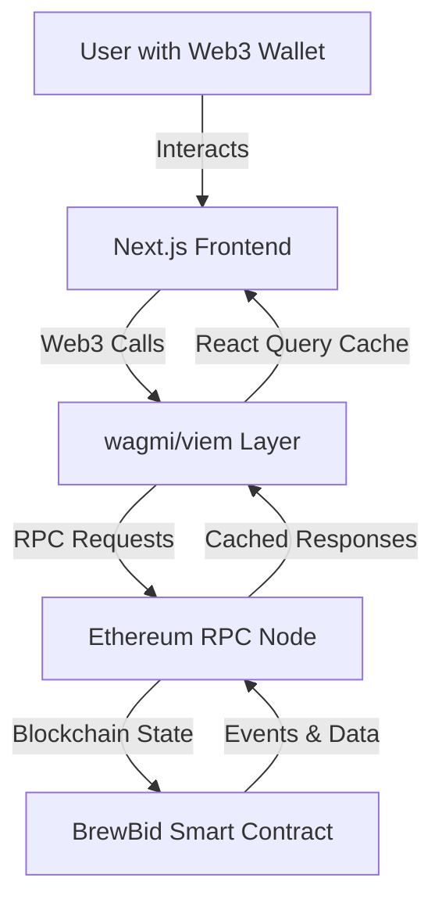

# Design Document: BrewBid Web3 Mini-dApp

## Overview

BrewBid is a full-stack Web3 application consisting of a Solidity smart contract and a Next.js frontend. The smart contract manages ETH tips with text memos on the Ethereum blockchain, while the frontend provides an intuitive interface for wallet connection, tip submission, and memo browsing.

The architecture follows a clear separation between blockchain logic (smart contract) and presentation logic (frontend), connected through Web3 libraries (wagmi/viem). The design prioritizes user experience through efficient caching with React Query and clear transaction state management.

### Key Design Decisions

1. **Hardhat for Smart Contract Development**: Provides robust testing framework and deployment tools
2. **wagmi + viem for Web3 Integration**: Modern, type-safe Web3 libraries with excellent React integration
3. **React Query for Data Caching**: Minimizes RPC calls and provides automatic cache invalidation
4. **Next.js App Router**: Leverages latest Next.js features for optimal performance
5. **Tailwind CSS**: Utility-first styling for rapid UI development and consistency

## Architecture

### System Architecture



### Project Structure

```
eth-spresso/
├── contracts/
│   ├── BrewBid.sol           # Main smart contract
│   └── test/
│       └── BrewBid.test.ts   # Contract tests
├── hardhat.config.ts            # Hardhat configuration
├── scripts/
│   └── deploy.ts                # Deployment script
├── frontend/
│   ├── app/
│   │   ├── layout.tsx           # Root layout with providers
│   │   ├── page.tsx             # Main page component
│   │   └── globals.css          # Global styles with Tailwind
│   ├── components/
│   │   ├── WalletConnect.tsx    # Wallet connection UI
│   │   ├── TipForm.tsx          # Tip submission form
│   │   ├── MemoList.tsx         # Display all memos
│   │   └── TransactionStatus.tsx # Transaction state feedback
│   ├── hooks/
│   │   ├── useContract.ts       # Contract interaction hook
│   │   ├── useMemos.ts          # Memo fetching with React Query
│   │   └── useSendTip.ts        # Tip submission logic
│   ├── lib/
│   │   ├── wagmi.ts             # wagmi configuration
│   │   └── contract.ts          # Contract ABI and address
│   ├── types/
│   │   └── index.ts             # TypeScript interfaces
│   └── next.config.js           # Next.js configuration
├── package.json
└── README.md
```

### Smart Contract Architecture

The BrewBid contract is a simple, gas-efficient contract with three core responsibilities:

1. **Ownership Tracking**: Records deployer address at construction
2. **Tip Processing**: Accepts ETH payments with memos, validates amount > 0
3. **Data Storage**: Maintains array of all tips with associated metadata

**Contract State:**
- `owner`: Address of contract deployer (immutable after deployment)
- `memos`: Dynamic array of Memo structs

**Contract Functions:**
- `buyCoffee(string memory _memo)`: Payable function to send tip with memo
- `getMemos()`: View function returning all stored memos
- `getOwner()`: View function returning owner address

**Events:**
- `NewTip`: Emitted on successful tip, contains all memo data for frontend indexing

### Frontend Architecture

The frontend follows a component-based architecture with clear separation of concerns:

**Layer 1: Providers (app/layout.tsx)**
- WagmiProvider: Web3 connection and wallet state
- QueryClientProvider: React Query cache management
- Wraps entire application

**Layer 2: Page Component (app/page.tsx)**
- Orchestrates main UI components
- Handles layout and responsive design

**Layer 3: Feature Components**
- WalletConnect: Wallet connection button and address display
- TipForm: Input form for memo and ETH amount
- MemoList: Displays all fetched memos
- TransactionStatus: Shows transaction state feedback

**Layer 4: Custom Hooks**
- useContract: Provides contract instance and configuration
- useMemos: Fetches and caches memo data with React Query
- useSendTip: Manages tip submission and transaction states

**Layer 5: Configuration**
- wagmi.ts: Chain configuration, RPC endpoints, wallet connectors
- contract.ts: Contract ABI and deployed address

### Data Flow

**Reading Memos:**
1. Component calls `useMemos()` hook
2. Hook checks React Query cache
3. If stale/missing, makes RPC call via wagmi
4. Contract returns memo array
5. Data cached and returned to component
6. Component renders memo list

**Sending Tips:**
1. User fills TipForm and submits
2. `useSendTip()` hook initiates transaction
3. State: "Waiting for Wallet" - user confirms in MetaMask
4. State: "Transaction Pending" - tx submitted to blockchain
5. wagmi watches transaction status
6. On confirmation: State: "Success", React Query invalidates memo cache
7. On error: State: "Error" with message
8. Memo list automatically refetches and updates

## Components and Interfaces

### Smart Contract Components

#### BrewBid Contract

```solidity
// SPDX-License-Identifier: MIT
pragma solidity ^0.8.0;

contract BrewBid {
    struct Memo {
        address sender;
        uint256 amount;
        string message;
        uint256 timestamp;
    }
    
    address public owner;
    Memo[] public memos;
    
    event NewTip(
        address indexed sender,
        uint256 amount,
        string message,
        uint256 timestamp
    );
    
    constructor() {
        owner = msg.sender;
    }
    
    function buyCoffee(string memory _memo) public payable {
        require(msg.value > 0, "Tip must be greater than 0");
        
        memos.push(Memo({
            sender: msg.sender,
            amount: msg.value,
            message: _memo,
            timestamp: block.timestamp
        }));
        
        emit NewTip(msg.sender, msg.value, _memo, block.timestamp);
    }
    
    function getMemos() public view returns (Memo[] memory) {
        return memos;
    }
    
    function getOwner() public view returns (address) {
        return owner;
    }
}
```

### Frontend Components

#### WalletConnect Component

**Purpose**: Provides wallet connection interface and displays connected address

**Props**: None (uses wagmi hooks internally)

**State**:
- Connected address from `useAccount()`
- Connection status from `useConnect()`

**Behavior**:
- Shows "Connect Wallet" button when disconnected
- Shows abbreviated address and "Disconnect" when connected
- Handles connection errors

#### TipForm Component

**Purpose**: Input form for submitting tips with memos

**Props**:
- `onSuccess`: Callback after successful tip submission

**State**:
- `memo`: String input for message
- `amount`: String input for ETH amount
- `isSubmitting`: Boolean for form disabled state

**Behavior**:
- Validates memo is not empty
- Validates amount is > 0
- Calls `useSendTip()` hook on submit
- Disables form during transaction
- Clears inputs on success

#### MemoList Component

**Purpose**: Displays all tips and memos from the contract

**Props**: None (fetches data internally)

**State**:
- Memo data from `useMemos()` hook
- Loading state
- Error state

**Behavior**:
- Shows loading spinner while fetching
- Displays error message if fetch fails
- Renders memo cards in reverse chronological order
- Formats ETH amounts and timestamps
- Shows abbreviated sender addresses

#### TransactionStatus Component

**Purpose**: Provides real-time feedback on transaction state

**Props**:
- `status`: "idle" | "waiting" | "pending" | "success" | "error"
- `error`: Error message if status is "error"
- `txHash`: Transaction hash if available

**Behavior**:
- Shows appropriate message for each state
- Displays spinner for waiting/pending states
- Shows success checkmark on confirmation
- Shows error icon and message on failure
- Provides Etherscan link when txHash available

### Custom Hooks

#### useContract Hook

**Purpose**: Provides configured contract instance

**Returns**:
- `contract`: Contract instance with ABI and address
- `address`: Deployed contract address
- `abi`: Contract ABI

**Implementation**:
```typescript
export function useContract() {
  const contract = {
    address: CONTRACT_ADDRESS,
    abi: CONTRACT_ABI,
  };
  
  return contract;
}
```

#### useMemos Hook

**Purpose**: Fetches and caches memo data with React Query

**Returns**:
- `data`: Array of memos
- `isLoading`: Boolean loading state
- `error`: Error object if fetch failed
- `refetch`: Function to manually refetch

**Implementation**:
```typescript
export function useMemos() {
  const contract = useContract();
  
  return useQuery({
    queryKey: ['memos'],
    queryFn: async () => {
      const memos = await readContract({
        ...contract,
        functionName: 'getMemos',
      });
      return memos;
    },
    staleTime: 30000, // 30 seconds
  });
}
```

#### useSendTip Hook

**Purpose**: Manages tip submission and transaction lifecycle

**Parameters**:
- `memo`: String message
- `amount`: String ETH amount

**Returns**:
- `sendTip`: Function to initiate transaction
- `status`: Current transaction state
- `error`: Error object if transaction failed
- `txHash`: Transaction hash when available

**Implementation**:
```typescript
export function useSendTip() {
  const contract = useContract();
  const queryClient = useQueryClient();
  const [status, setStatus] = useState('idle');
  
  const { writeContract, data: txHash } = useWriteContract();
  const { isLoading, isSuccess } = useWaitForTransaction({ hash: txHash });
  
  const sendTip = async (memo: string, amount: string) => {
    setStatus('waiting');
    await writeContract({
      ...contract,
      functionName: 'buyCoffee',
      args: [memo],
      value: parseEther(amount),
    });
    setStatus('pending');
  };
  
  useEffect(() => {
    if (isSuccess) {
      setStatus('success');
      queryClient.invalidateQueries(['memos']);
    }
  }, [isSuccess]);
  
  return { sendTip, status, txHash };
}
```

## Data Models

### Smart Contract Data Models

#### Memo Struct

```solidity
struct Memo {
    address sender;    // Address of tip sender
    uint256 amount;    // Tip amount in wei
    string message;    // User's memo text
    uint256 timestamp; // Block timestamp when tip was sent
}
```

**Storage**: Dynamic array `Memo[] public memos`

**Access Pattern**: Sequential read via `getMemos()`, append-only writes via `buyCoffee()`

### Frontend Data Models

#### TypeScript Interfaces

```typescript
// Memo data from contract
interface Memo {
  sender: `0x${string}`;
  amount: bigint;
  message: string;
  timestamp: bigint;
}

// Formatted memo for display
interface FormattedMemo {
  sender: string;           // Abbreviated address
  amount: string;           // ETH amount as string
  message: string;
  timestamp: string;        // Formatted date/time
  txHash?: `0x${string}`;   // Optional transaction hash
}

// Transaction state
type TransactionStatus = 
  | 'idle' 
  | 'waiting'   // Waiting for wallet confirmation
  | 'pending'   // Transaction submitted, awaiting confirmation
  | 'success'   // Transaction confirmed
  | 'error';    // Transaction failed or rejected

// Transaction state object
interface TransactionState {
  status: TransactionStatus;
  error?: Error;
  txHash?: `0x${string}`;
}

// Form input state
interface TipFormData {
  memo: string;
  amount: string;
}
```

### Data Transformation

**Contract to Display:**
```typescript
function formatMemo(memo: Memo): FormattedMemo {
  return {
    sender: `${memo.sender.slice(0, 6)}...${memo.sender.slice(-4)}`,
    amount: formatEther(memo.amount),
    message: memo.message,
    timestamp: new Date(Number(memo.timestamp) * 1000).toLocaleString(),
  };
}
```

**User Input to Contract:**
```typescript
function prepareTipData(formData: TipFormData) {
  return {
    memo: formData.memo,
    value: parseEther(formData.amount), // Convert ETH string to wei bigint
  };
}
```


## Correctness Properties

*A property is a characteristic or behavior that should hold true across all valid executions of a system—essentially, a formal statement about what the system should do. Properties serve as the bridge between human-readable specifications and machine-verifiable correctness guarantees.*

### Property Reflection

After analyzing all acceptance criteria, I identified the following redundancies:

- Properties 1.1 and 1.2 both test memo storage correctness. Property 1.2 (complete data integrity) subsumes Property 1.1 (basic storage), so we'll combine them into a single comprehensive property.
- Properties 3.2 and 1.2 both verify that stored data matches sent data. Property 3.2 (retrieval correctness) is essentially testing the same invariant as 1.2 through a different lens. We'll keep 1.2 as the primary property since it's more direct.
- Properties 7.1, 7.2, 7.3, and 7.4 all test transaction state transitions. These can be combined into a single comprehensive property about state machine correctness.

### Smart Contract Properties

### Property 1: Tip Storage Integrity

*For any* valid tip transaction with ETH amount > 0 and any memo string, when the tip is sent to the contract, retrieving the memos should return an entry where the sender address matches the transaction sender, the amount matches the sent value, the message matches the provided memo, and the timestamp is the block timestamp.

**Validates: Requirements 1.1, 1.2, 3.2**

### Property 2: Event Emission Completeness

*For any* valid tip transaction, when the transaction is successfully processed, the contract should emit a NewTip event containing the sender address, tip amount, memo text, and timestamp that exactly match the stored memo data.

**Validates: Requirements 1.3**

### Property 3: Zero Amount Rejection

*For any* memo string, when a transaction is sent with 0 ETH, the contract should revert the transaction and not store any memo data.

**Validates: Requirements 1.4**

### Property 4: Memo Retrieval Completeness

*For any* sequence of valid tips sent to the contract, calling getMemos() should return all tips in the order they were sent with no missing or duplicate entries.

**Validates: Requirements 3.2**

### Frontend Properties

### Property 5: Memo Display Completeness

*For any* set of memos retrieved from the contract, the frontend should render all memos in the display list with no missing entries.

**Validates: Requirements 5.1**

### Property 6: Memo Field Display

*For any* memo, when rendered in the frontend, the displayed output should contain the sender address, tip amount in ETH, memo text, and formatted timestamp.

**Validates: Requirements 5.2**

### Property 7: RPC Call Caching

*For any* memo data fetch, when the data is successfully retrieved and cached, subsequent requests within the stale time window should not trigger additional RPC calls to the blockchain.

**Validates: Requirements 6.2**

### Property 8: Cache Revalidation

*For any* cached memo data, when the stale time expires, the next data access should trigger a new RPC call to revalidate the cache.

**Validates: Requirements 6.3**

### Property 9: Transaction State Machine

*For any* tip submission, the transaction status should progress through the correct sequence: idle → waiting (on wallet confirmation) → pending (on blockchain submission) → success (on confirmation) OR error (on failure/rejection), and each state should display the appropriate UI feedback.

**Validates: Requirements 7.1, 7.2, 7.3, 7.4**

### Property 10: Connected Wallet Display

*For any* connected wallet, the frontend should display the wallet address in the UI.

**Validates: Requirements 8.3**

### Property 11: Conditional Form Enablement

*For any* wallet connection state, the tip submission form should be enabled if and only if a wallet is connected.

**Validates: Requirements 8.4**

### Property 12: Responsive Layout

*For any* viewport size (mobile or desktop), the frontend should render all UI elements in a readable and accessible layout without horizontal scrolling or overlapping elements.

**Validates: Requirements 9.3**

## Error Handling

### Smart Contract Error Handling

**Zero Amount Tips:**
- Error: "Tip must be greater than 0"
- Trigger: `msg.value == 0` in `buyCoffee()`
- Behavior: Transaction reverts, no state changes, gas refunded (minus execution cost)

**Out of Gas:**
- Error: Implicit EVM out-of-gas error
- Trigger: Insufficient gas provided for transaction
- Behavior: Transaction reverts, no state changes
- Mitigation: Frontend estimates gas and adds 20% buffer

**Memo Array Growth:**
- Concern: Unbounded array growth could make `getMemos()` expensive
- Mitigation: Document gas costs, consider pagination in future versions
- Current: Acceptable for demo/small-scale usage

### Frontend Error Handling

**Wallet Connection Errors:**
- User rejects connection: Display "Connection rejected" message
- No wallet installed: Display "Please install MetaMask" with link
- Wrong network: Display "Please switch to [network name]" with switch button
- Network error: Display "Network error, please try again"

**Transaction Errors:**
- User rejects transaction: Set status to "error" with "Transaction rejected by user"
- Insufficient funds: Display "Insufficient ETH balance"
- Gas estimation failure: Display "Unable to estimate gas, please try again"
- Transaction reverted: Display revert reason from contract
- Network timeout: Display "Transaction timeout, check wallet for status"

**Data Fetching Errors:**
- RPC node unavailable: Display "Unable to connect to network"
- Contract not found: Display "Contract not deployed on this network"
- Invalid contract response: Display "Error reading contract data"
- Retry mechanism: React Query automatic retry with exponential backoff (3 attempts)

**Form Validation Errors:**
- Empty memo: Display "Please enter a message"
- Invalid amount: Display "Please enter a valid ETH amount"
- Amount <= 0: Display "Amount must be greater than 0"
- Non-numeric amount: Display "Please enter a valid number"

**Error Recovery:**
- All errors include actionable messages
- Transaction errors preserve form data for retry
- Network errors trigger automatic retry
- User can manually retry failed operations
- Error states clear on successful retry

## Testing Strategy

### Smart Contract Testing

**Framework:** Hardhat with ethers.js and Chai assertions

**Test Categories:**

1. **Unit Tests** - Specific examples and edge cases
   - Deployment sets correct owner
   - Single tip with valid data stores correctly
   - Zero ETH tip reverts with correct error message
   - Empty memo string is accepted (edge case)
   - Very long memo string is accepted (edge case)
   - Multiple tips from same address
   - Owner getter returns correct address

2. **Property-Based Tests** - Universal properties across all inputs
   - Minimum 100 iterations per property test
   - Use fast-check library for property-based testing in TypeScript

**Property Test Implementations:**

```typescript
// Feature: eth-spresso, Property 1: Tip Storage Integrity
it('property: stored memo data matches sent data', async () => {
  await fc.assert(
    fc.asyncProperty(
      fc.string({ minLength: 1 }), // memo
      fc.bigInt({ min: 1n, max: 10n ** 18n }), // amount in wei
      async (memo, amount) => {
        const [sender] = await ethers.getSigners();
        await contract.buyCoffee(memo, { value: amount });
        const memos = await contract.getMemos();
        const lastMemo = memos[memos.length - 1];
        
        expect(lastMemo.sender).to.equal(sender.address);
        expect(lastMemo.amount).to.equal(amount);
        expect(lastMemo.message).to.equal(memo);
        expect(lastMemo.timestamp).to.be.gt(0);
      }
    ),
    { numRuns: 100 }
  );
});

// Feature: eth-spresso, Property 2: Event Emission Completeness
it('property: NewTip event contains correct data', async () => {
  await fc.assert(
    fc.asyncProperty(
      fc.string({ minLength: 1 }),
      fc.bigInt({ min: 1n, max: 10n ** 18n }),
      async (memo, amount) => {
        const [sender] = await ethers.getSigners();
        const tx = await contract.buyCoffee(memo, { value: amount });
        const receipt = await tx.wait();
        const event = receipt.events?.find(e => e.event === 'NewTip');
        
        expect(event.args.sender).to.equal(sender.address);
        expect(event.args.amount).to.equal(amount);
        expect(event.args.message).to.equal(memo);
        expect(event.args.timestamp).to.be.gt(0);
      }
    ),
    { numRuns: 100 }
  );
});

// Feature: eth-spresso, Property 3: Zero Amount Rejection
it('property: zero ETH tips always revert', async () => {
  await fc.assert(
    fc.asyncProperty(
      fc.string(),
      async (memo) => {
        await expect(
          contract.buyCoffee(memo, { value: 0 })
        ).to.be.revertedWith('Tip must be greater than 0');
      }
    ),
    { numRuns: 100 }
  );
});

// Feature: eth-spresso, Property 4: Memo Retrieval Completeness
it('property: getMemos returns all sent tips in order', async () => {
  await fc.assert(
    fc.asyncProperty(
      fc.array(
        fc.record({
          memo: fc.string({ minLength: 1 }),
          amount: fc.bigInt({ min: 1n, max: 10n ** 17n })
        }),
        { minLength: 1, maxLength: 10 }
      ),
      async (tips) => {
        const initialLength = (await contract.getMemos()).length;
        
        for (const tip of tips) {
          await contract.buyCoffee(tip.memo, { value: tip.amount });
        }
        
        const memos = await contract.getMemos();
        const newMemos = memos.slice(initialLength);
        
        expect(newMemos.length).to.equal(tips.length);
        for (let i = 0; i < tips.length; i++) {
          expect(newMemos[i].message).to.equal(tips[i].memo);
          expect(newMemos[i].amount).to.equal(tips[i].amount);
        }
      }
    ),
    { numRuns: 100 }
  );
});
```

**Test Execution:**
```bash
npx hardhat test
```

**Coverage Target:** 100% line and branch coverage for smart contract

### Frontend Testing

**Framework:** Vitest + React Testing Library + MSW (Mock Service Worker)

**Test Categories:**

1. **Unit Tests** - Component behavior and edge cases
   - WalletConnect shows "Connect" button when disconnected
   - WalletConnect shows address when connected
   - TipForm validates empty memo
   - TipForm validates zero/negative amount
   - MemoList shows loading state
   - MemoList shows error state
   - TransactionStatus shows correct message for each state
   - Memo formatting (address abbreviation, ETH conversion, timestamp)

2. **Integration Tests** - Component interaction
   - Wallet connection enables TipForm
   - Successful tip submission updates MemoList
   - Transaction error displays in TransactionStatus
   - Cache invalidation triggers refetch

3. **Property-Based Tests** - Universal properties
   - Use fast-check library for frontend property tests
   - Minimum 100 iterations per property test

**Property Test Implementations:**

```typescript
// Feature: eth-spresso, Property 5: Memo Display Completeness
it('property: all memos are displayed', () => {
  fc.assert(
    fc.property(
      fc.array(
        fc.record({
          sender: fc.hexaString({ minLength: 40, maxLength: 40 }),
          amount: fc.bigInt({ min: 1n, max: 10n ** 18n }),
          message: fc.string(),
          timestamp: fc.bigInt({ min: 1n, max: BigInt(Date.now()) })
        }),
        { maxLength: 20 }
      ),
      (memos) => {
        const { container } = render(<MemoList memos={memos} />);
        const memoElements = container.querySelectorAll('[data-testid="memo-item"]');
        expect(memoElements.length).toBe(memos.length);
      }
    ),
    { numRuns: 100 }
  );
});

// Feature: eth-spresso, Property 6: Memo Field Display
it('property: memo display contains all required fields', () => {
  fc.assert(
    fc.property(
      fc.record({
        sender: fc.hexaString({ minLength: 40, maxLength: 40 }).map(s => `0x${s}`),
        amount: fc.bigInt({ min: 1n, max: 10n ** 18n }),
        message: fc.string({ minLength: 1 }),
        timestamp: fc.bigInt({ min: 1n, max: BigInt(Date.now()) })
      }),
      (memo) => {
        const { container } = render(<MemoItem memo={memo} />);
        const text = container.textContent;
        
        expect(text).toContain(memo.sender.slice(0, 6));
        expect(text).toContain(memo.message);
        expect(text).toMatch(/\d+\.?\d*/); // Contains numeric amount
      }
    ),
    { numRuns: 100 }
  );
});

// Feature: eth-spresso, Property 9: Transaction State Machine
it('property: transaction states progress correctly', async () => {
  await fc.assert(
    fc.asyncProperty(
      fc.record({
        memo: fc.string({ minLength: 1 }),
        amount: fc.double({ min: 0.001, max: 1.0 })
      }),
      async (tipData) => {
        const states: TransactionStatus[] = [];
        const { result } = renderHook(() => useSendTip());
        
        // Monitor state changes
        watchEffect(() => states.push(result.current.status));
        
        await act(async () => {
          await result.current.sendTip(tipData.memo, tipData.amount.toString());
        });
        
        // Verify state progression
        expect(states).toContain('waiting');
        expect(states).toContain('pending');
        expect(states[states.length - 1]).toMatch(/success|error/);
      }
    ),
    { numRuns: 100 }
  );
});

// Feature: eth-spresso, Property 11: Conditional Form Enablement
it('property: form enabled state matches wallet connection', () => {
  fc.assert(
    fc.property(
      fc.boolean(),
      (isConnected) => {
        const { container } = render(
          <TipForm />,
          { wrapper: createWalletWrapper({ isConnected }) }
        );
        
        const submitButton = container.querySelector('button[type="submit"]');
        expect(submitButton.disabled).toBe(!isConnected);
      }
    ),
    { numRuns: 100 }
  );
});
```

**Mock Strategy:**
- Mock wagmi hooks for wallet state
- Mock contract reads/writes with MSW
- Mock React Query for cache testing
- Use test fixtures for memo data

**Test Execution:**
```bash
npm run test        # Run all tests
npm run test:watch  # Watch mode for development
npm run test:coverage # Generate coverage report
```

**Coverage Target:** 80% line coverage for frontend components

### End-to-End Testing

**Framework:** Playwright (optional for production deployment)

**Test Scenarios:**
- Complete user flow: connect wallet → send tip → view memo
- Error recovery: rejected transaction → retry
- Network switching
- Mobile responsive behavior

**Note:** E2E tests require local blockchain (Hardhat node) and test wallet setup.

### Testing Best Practices

1. **Property tests handle comprehensive input coverage** - avoid writing many similar unit tests
2. **Unit tests focus on specific examples and edge cases** - empty strings, boundary values, error conditions
3. **Each property test references its design document property** - maintains traceability
4. **Mock external dependencies** - wallet, RPC, blockchain state
5. **Test isolation** - each test deploys fresh contract or resets state
6. **Deterministic tests** - use fixed block timestamps in tests
7. **Gas optimization tests** - verify operations stay within reasonable gas limits

