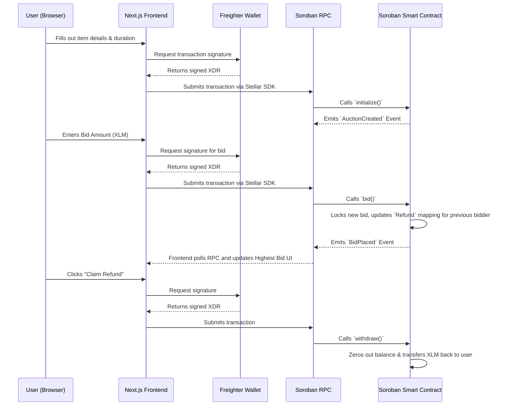

# BrewBid Architecture Diagram

BrewBid operates on a decentralized architecture leveraging the Stellar network and Soroban smart contracts. The application is divided into three main layers: the Client (Frontend), the Network (RPC & Wallet), and the Ledger (Smart Contract).

## System Flow Diagram

## Component Breakdown

1. **Frontend (Next.js / React):** Handles user inputs and displays real-time data. It uses `@stellar/stellar-sdk` to poll the Soroban RPC for contract events, ensuring the UI always reflects the current highest bid.
2. **Wallet (Freighter):** Integrated via `@stellar/freighter-api`. It securely holds the user's private keys and signs the `xdr` transaction payloads generated by the frontend.
3. **Soroban RPC:** The bridge between the off-chain frontend and the on-chain network. It simulates transactions to calculate fees and submits signed transactions to the Stellar network.
4. **Smart Contract (Rust):** The core escrow engine. It securely holds the highest bidder's XLM. To prevent malicious contract locking, it utilizes a "pull" refund pattern, requiring outbid users to initiate a withdrawal transaction to reclaim their funds.
