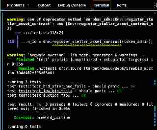

# BrewBid ☕ - Real-Time Decentralized Auction dApp

**Stellar Journey to Mastery — Blue Belt (Level 5) Submission**

BrewBid is a real-time decentralized auction platform built on the Stellar network leveraging Soroban smart contracts. It allows users to list digital items for auction with strict time limits, while buyers connect their Freighter wallets to place secure, escrowed bids. 

## 🔗 Level 3 Submission Links
* **Contract ID**: `CCLI6FFDYPVD7E6A45Q6QKHADRAOJTQXE35H5KQGQMYJTFJECXJQNVCV` (Testnet)
* **Live Demo**: [https://frontend-chi-wheat-42.vercel.app](https://frontend-chi-wheat-42.vercel.app)
* **Demo Video**: [https://drive.google.com/file/d/1BwanzgiJ36qMccIvlhk1UjBdTJTPGKyE/view?usp=sharing](https://drive.google.com/file/d/1BwanzgiJ36qMccIvlhk1UjBdTJTPGKyE/view?usp=sharing)
* **Screenshot (3 Passing Tests)**: 

---

## 🏗️ Architecture & Technical Scope

BrewBid focuses on seamless frontend-to-backend integration within the Stellar ecosystem. 

* **Frontend (Next.js & Tailwind CSS):** Listens to Stellar network RPC polling to provide real-time UI updates on the current highest bid without requiring page refreshes.
* **Wallet Integration:** Utilizes `@stellar/freighter-api` to authenticate users and securely sign `xdr` transactions.
* **Smart Contract (Soroban/Rust):** Acts as a trustless escrow. It locks the highest bidder's funds and utilizes a "pull" refund mechanism to allow outbid users to securely withdraw their locked funds. Once the block time expires, the contract executes final settlement.

---

## 👥 User Validation (Level 3 Requirement)

To ensure a polished and frictionless user experience, BrewBid was tested by testnet users who executed both the "Seller" and "Bidder" flows. 

### Verifiable Testnet Users
1. `GBHA2H7RRFAE5QINGF3BLSZGLPEBTM5EW7A547PJ4E26L4Z7MMLAOJEE` - [View on Stellar.Expert](https://stellar.expert/explorer/testnet/account/GBHA2H7RRFAE5QINGF3BLSZGLPEBTM5EW7A547PJ4E26L4Z7MMLAOJEE)

### 🔄 Feedback Iteration & Improvement
Based on user feedback, we implemented a loading state on the bidding button that disables input and provides visual feedback during RPC simulation and network submission.

**Proof of Work (Git Commit):** [View Commit](https://github.com/KB2410/BrewBid/commit/...) <!-- TODO: User, link the specific commit here -->

---

## 💻 Local Setup & Deployment

### Prerequisites
* Node.js (v18+)
* Rust & Soroban CLI
* Freighter Wallet Browser Extension

### Running the Frontend
```bash
cd frontend
npm install
npm run dev
```

### Running Smart Contract Tests
Ensure you are in the `soroban-contracts` directory:
```bash
cd soroban-contracts
cargo test
```

### Contract Deployment (Testnet)
```bash
soroban contract build
soroban contract deploy \
  --wasm target/wasm32-unknown-unknown/release/brewbid_auction.wasm \
  --source [YOUR_TESTNET_IDENTITY] \
  --network testnet
```
